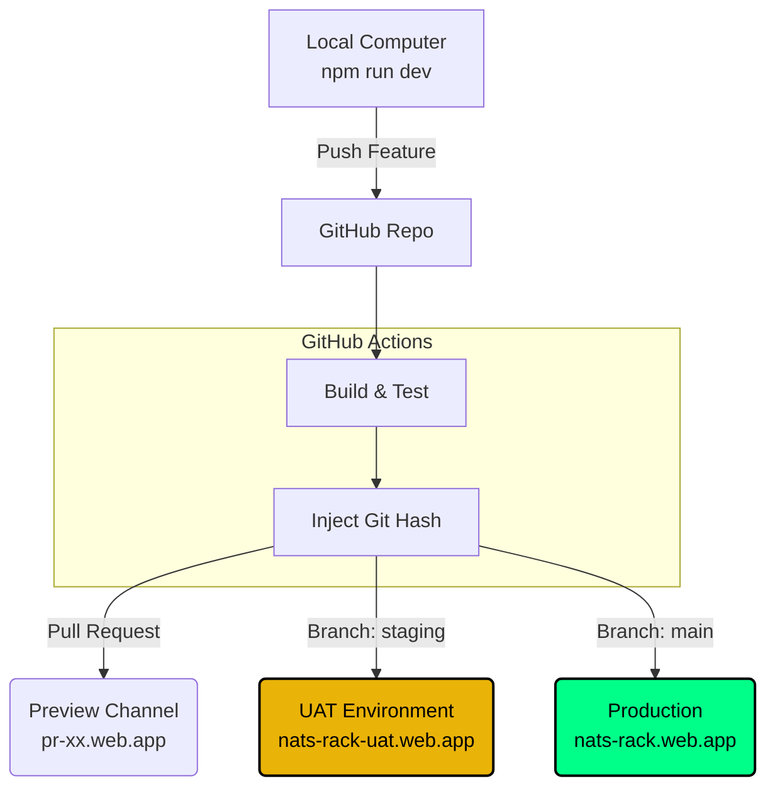

### Key Audio Components:

* **Source:** `Tone.Player` handling the .wav sample.
* **Mute Logic:** Applied to the **Source** (Player), not the Channel. This ensures reverb tails are cut immediately when muted.
* **Export:** The `Tone.Recorder` captures the output of the Limiter, ensuring the downloaded file matches the playback exactly.

---

## 3. DevOps & Deployment Pipeline

We utilize a **3-Tier Environment Strategy** hosted on Firebase. The environment is determined by the URL hostname and is managed automatically by GitHub Actions.



### Environment Definitions:

* **DEV (Local):** Unrestricted access. Features the "Blue Banner".
* **UAT (Staging):** The Release Candidate. Features the "Yellow Warning Banner". Used for smoke testing before production.
* **PROD (Live):** The public application. No banners. Optimized assets.

---

## 4. State Management (Zustand)

The application state is divided into **Persistent** (User Data) and **Transient** (Playback Data). We use the `persist` middleware to save specific slices to `localStorage`.

| State Slice | Persistence | Description |
| --- | --- | --- |
| `patterns` | **YES** | The grid data (notes) for all patterns (A, B, etc). |
| `timeline` | **YES** | The arrangement array (e.g., `['A', 'A', 'B']`). |
| `mixer` | **YES** | Volume, Pan, Send, and Mute status. |
| `bpm` | **YES** | Global tempo. |
| `isPlaying` | NO | Always resets to `false` on reload. |
| `currentStep` | NO | Visual playback cursor position. |
| `isExporting` | NO | UI lock state during bounce. |

---

## 5. Directory Structure

```text
src/
├── audio/          # Tone.js logic (The "Back End")
│   └── Engine.js   # Singleton class managing the AudioContext
├── features/       # UI Components (The "Front End")
│   ├── arranger/   # Timeline Editor
│   ├── mixer/      # Faders & Knobs
│   └── sequencer/  # The Grid
│   └── common/     # Shared UI (EnvironmentBanner)
├── store/          # State Management
│   └── useProject.js
└── main.jsx        # Entry point

```

```

```